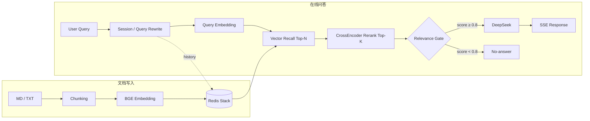

# Enterprise RAG Knowledge Base Backend

基于 FastAPI、Redis Stack、BGE Embedding / Reranker 与 DeepSeek 构建的企业知识库 RAG 后端，支持文档导入、两阶段检索、多轮问答、相关性拒答、SSE 流式输出与离线评测。

## 1. 核心功能

| 模块 | 实现 |
| --- | --- |
| 文档接入 | 支持 Markdown / TXT 文本导入与文件上传 |
| 文档处理 | Chunking + `BAAI/bge-small-zh-v1.5` Embedding（512 维） |
| 向量检索 | Redis Stack / RediSearch HNSW 余弦相似度召回 |
| 两阶段检索 | Recall Top-N → `BAAI/bge-reranker-base` Rerank Top-K |
| 相关性判断 | Relevance Gate，根据 top-1 rerank score 判断是否进入生成阶段 |
| 多轮问答 | Redis Session + Query Rewrite |
| RAG 生成 | DeepSeek `deepseek-chat` |
| 流式响应 | SSE `delta / done / error` |
| 离线评测 | Retrieval、Rerank、Relevance Gate、多轮改写评测 |
| 部署 | Docker Compose 启动 FastAPI + Redis Stack |

## 2. 系统架构

系统包含文档写入和在线问答两条主要链路。Redis Stack 同时用于向量检索和会话存储。



在线检索流程：

`Query → Query Rewrite → Vector Recall → CrossEncoder Rerank → Relevance Gate → DeepSeek → SSE`

其中 Query Rewrite 仅在存在会话历史时用于补全指代和上下文；Relevance Gate 未通过时直接返回“根据当前知识库无法确定。”，不调用 DeepSeek。

主要参数：

| 参数 | 默认值 | 作用 |
| --- | ---: | --- |
| `RECALL_TOP_N` | 10 | 向量召回候选数 |
| `RERANK_TOP_K` | 3 | 精排后保留候选数 |
| `RERANK_RELEVANCE_THRESHOLD` | 0.8 | Relevance Gate 阈值 |
| `CHUNK_SIZE` | 600 | Chunk 大小 |
| `CHUNK_OVERLAP` | 100 | Chunk 重叠长度 |

## 3. 技术栈

| 类别 | 技术 |
| --- | --- |
| 语言 | Python 3.12 |
| Web | FastAPI、Uvicorn、Pydantic v2 |
| 向量数据库 | Redis Stack / RediSearch |
| Embedding | `BAAI/bge-small-zh-v1.5` |
| Reranker | `BAAI/bge-reranker-base` |
| LLM | DeepSeek `deepseek-chat` |
| 测试 | pytest |
| 部署 | Docker、Docker Compose |

## 4. API

| 方法 | 接口 | 说明 |
| --- | --- | --- |
| `GET` | `/health` | 服务健康检查 |
| `POST` | `/api/v1/document/import` | 通过 JSON 导入文本 |
| `POST` | `/api/v1/document/upload` | 上传 `.md` / `.txt` 文件 |
| `POST` | `/api/v1/chat/completions` | RAG 问答，SSE 流式返回 |
| `GET` | `/api/v1/chat/history/{session_id}` | 查询会话历史 |
| `DELETE` | `/api/v1/chat/session/{session_id}` | 清除会话 |

启动服务后可通过 `http://localhost:8000/docs` 查看完整 Swagger API 文档。

文档上传采用 `multipart/form-data`，单文件默认上限为 5 MB。对话接口返回 `text/event-stream`，包含 `delta`、`done` 和 `error` 三类事件。

## 5. 评测结果

项目使用独立的 Evaluation v2 数据集验证检索、精排和 Relevance Gate。测试知识库由 6 份企业 IT 运维类文档组成，共生成 88 个 chunks；评测集包含 96 条用例，覆盖直接问答、改写问答、实体区分、多轮问题、hard negative 和 irrelevant query。

### 5.1 检索与精排

| 指标 | Vector Recall | CrossEncoder Rerank |
| --- | ---: | ---: |
| Hit@1 | 0.7903 | **0.8387** |
| MRR | 0.8575 | **0.8790** |
| Hit@3 | 0.9355 | — |
| Hit@5 | 0.9355 | — |
| Recall@5 | 0.8844 | — |

CrossEncoder 精排后，Hit@1 由 0.7903 提升至 0.8387，MRR 由 0.8575 提升至 0.8790。

### 5.2 Relevance Gate 阈值

| Threshold | FP | FN |
| ---: | ---: | ---: |
| 0.5 | 8 | 0 |
| **0.8** | **5** | **0** |
| 0.9 | 2 | 1 |

当前使用 `threshold = 0.8`：相比 0.5，FP 由 8 降至 5，且没有新增 FN；继续提高到 0.9 后开始出现 FN。因此 0.8 作为当前评测集下的运行阈值。该阈值与当前知识库和评测数据相关，数据分布变化后需要重新评估。

完整结果见 `evaluation/reports/evaluation_v2.md`。

## 6. 关键实现

### 6.1 两阶段检索

向量检索负责从知识库中快速召回 Top-N 候选，CrossEncoder 再对 Query–Chunk 对进行精排。这样既保留向量检索的召回效率，也利用 CrossEncoder 提高候选排序质量。

### 6.2 多轮 Query Rewrite

会话历史保存在 Redis。存在历史上下文时，系统先将当前问题改写为可独立检索的问题，再进行 Embedding 和 Retrieval；Redis 中仍保存用户的原始问题。

### 6.3 Relevance Gate

Rerank 后取 top-1 score 与阈值比较。相关性不足或没有召回结果时直接拒答，避免无关上下文继续进入生成阶段。

需要注意，CrossEncoder score 衡量的是 Query 与 Chunk 的相关程度，并不能直接证明 Chunk 中一定存在充分答案。因此主题相近但知识库实际未提供答案的问题仍可能获得较高分，这是当前单阈值方案的主要限制。

## 7. 快速启动

推荐使用 Docker Compose。

```bash
# 1. 克隆项目
git clone <repo-url>
cd Enterprise_RAG

# 2. 创建本地配置
cp .env.example .env
# 在 .env 中填写 DEEPSEEK_API_KEY

# 3. 构建并启动
docker compose up -d --build

# 4. 查看运行状态
docker compose ps
```

启动后：

- Swagger API 文档：`http://localhost:8000/docs`
- 健康检查：`http://localhost:8000/health`

停止服务：

```bash
docker compose down
```

首次运行需要下载 `bge-small-zh-v1.5` 和 `bge-reranker-base`。模型下载完成后由 HuggingFace 缓存卷复用。

> `.env` 已加入 `.gitignore`，API Key 等敏感配置通过环境变量注入；仓库使用 `.env.example` 提供配置模板。

### 7.1 本地开发

```bash
python -m venv .venv
.venv/Scripts/activate
pip install -r requirements.txt -r requirements-dev.txt
uvicorn app.main:app --reload
```

本地运行时需要单独启动 Redis Stack，默认连接 `redis://localhost:6379`。

## 8. 项目结构

```text
Enterprise_RAG/
├── app/
│   ├── api/                    # API 路由与异常处理
│   ├── models/                 # Pydantic 数据模型
│   ├── services/               # RAG 核心服务
│   ├── config.py               # 环境与运行参数
│   └── main.py                 # FastAPI 入口
├── tests/                      # 单元测试与集成测试
├── evaluation/                 # Evaluation v2 数据集、评测逻辑与报告
├── scripts/                    # 手动验证脚本
├── Dockerfile
├── compose.yaml
├── DOCKER.md
├── requirements.txt
├── requirements-dev.txt
└── README.md
```

`app/services/` 包含 Chunking、Embedding、Vector Store、Retrieval、Reranker、Relevance Gate、Query Rewrite、Session、LLM 与 RAG 编排等核心模块。

## 9. 测试

```bash
pytest
pytest -m integration
```

当前全量测试结果：**245 passed, 0 failed**。

依赖 Redis 的集成测试会先检查服务可用性；Redis 未启动时相关测试自动 skip，以区分外部依赖不可用与代码测试失败。

## 10. 当前范围

当前版本重点验证 RAG 后端完整链路及其评测方法，暂未实现 PDF / DOCX 解析、Citation、前端、用户鉴权和 Multi-signal Gate。

Evaluation v2 也表明，单一 rerank threshold 无法完全区分“可以回答”和“主题相关但缺少答案”的问题；如果继续扩展，可在现有 Gate 基础上引入更多判定信号。
