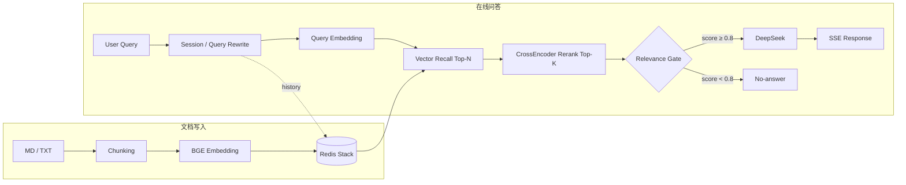

# 企业知识库 RAG 后端 · Enterprise RAG Knowledge Base Backend


基于 **FastAPI、Redis Stack、BGE Embedding / Reranker 与 DeepSeek** 构建的企业知识库 RAG 后端原型，覆盖从文档导入、向量召回、CrossEncoder 精排、相关性拒答，到多轮 Query Rewrite、LLM 生成与 SSE 流式输出的完整链路。

项目重点围绕 **检索质量优化** 与 **问答可靠性控制** 展开，并通过单元测试、集成测试和 Evaluation v2 数据集对核心链路进行实际验证。

> 当前项目定位为 **enterprise-style / production-like RAG backend prototype**，聚焦后端核心能力，不包含前端、用户鉴权、PDF / DOCX 解析和完整 Citation 展示。

---

## 1. 系统概述

系统包含两条主要链路：**文档写入链路** 与 **在线问答链路**。Redis Stack 同时承担向量检索与会话存储职责。

### 1.1 文档写入

```text
Markdown / TXT
      │
      ▼
   Chunking
      │
      ▼
 BGE Embedding
      │
      ▼
 Redis Vector Store
```

### 1.2 在线问答

```text
User Query
    │
    ▼
Session / Query Rewrite
    │
    ▼
Query Embedding
    │
    ▼
Vector Recall Top-N
    │
    ▼
CrossEncoder Rerank Top-K
    │
    ▼
Relevance Gate
   /        \
  /          \
通过          未通过
 │              │
 ▼              ▼
DeepSeek      No-answer
 │
 ▼
SSE Response
```

完整在线检索流程：

`Query → Query Rewrite → Vector Recall → CrossEncoder Rerank → Relevance Gate → DeepSeek → SSE`

其中，Query Rewrite 仅在存在会话历史时用于补全指代和上下文；Relevance Gate 未通过时直接返回“根据当前知识库无法确定。”，不调用 DeepSeek。

---

## 2. 项目重点

项目重点围绕 **检索质量优化** 与 **问答可靠性控制** 两个方向展开。

### 2.1 检索质量优化

系统采用 **Vector Recall + CrossEncoder Rerank** 的两阶段检索方案。Redis HNSW 负责快速召回 Top-N 候选，`BAAI/bge-reranker-base` 再对 Query–Chunk 对进行精排，提高高相关内容进入最终 Top-K 上下文的概率。

Evaluation v2 结果显示，Rerank 后 Hit@1 由 `0.7903` 提升至 `0.8387`，MRR 由 `0.8575` 提升至 `0.8790`。

### 2.2 问答可靠性控制

系统在生成阶段前加入 **Relevance Gate**。当 top-1 rerank score 低于阈值时直接拒答，不再调用 DeepSeek，减少明显无关上下文进入生成阶段的风险。

对于多轮问题，系统通过 **Redis Session + Query Rewrite** 处理省略、指代和上下文依赖，使当前问题先改写为可独立检索的 Query，再进入后续 Retrieval 流程。

Relevance Gate 阈值通过 Evaluation v2 进行对比评估，当前运行阈值为 `0.8`。同时保留“相关性不等于可回答性”这一设计边界。

---

## 3. 核心功能

| 模块 | 实现 |
|---|---|
| 文档接入 | 支持 Markdown / TXT 文本导入与文件上传 |
| 文档处理 | Chunking + `BAAI/bge-small-zh-v1.5` Embedding（512 维） |
| 向量检索 | Redis Stack / RediSearch HNSW 余弦相似度召回 |
| 两阶段检索 | Vector Recall Top-N → `BAAI/bge-reranker-base` Rerank Top-K |
| 相关性拒答 | Relevance Gate，根据 top-1 rerank score 判断是否进入生成阶段 |
| 多轮问答 | Redis Session + Query Rewrite |
| RAG 生成 | DeepSeek `deepseek-chat` |
| 流式响应 | SSE `delta / done / error` |
| 离线评测 | Retrieval、Rerank、Relevance Gate、多轮改写评测 |
| 工程化部署 | Docker Compose、Redis 持久化、健康检查、模型缓存 |
| 自动化测试 | pytest 单元测试与集成测试，当前 **245 passed, 0 failed** |

---

## 4. 系统架构



### 4.1 主要参数

| 参数 | 默认值 | 作用 |
|---|---:|---|
| `RECALL_TOP_N` | 10 | 向量召回候选数 |
| `RERANK_TOP_K` | 3 | 精排后保留候选数 |
| `RERANK_RELEVANCE_THRESHOLD` | 0.8 | Relevance Gate 阈值 |
| `CHUNK_SIZE` | 600 | Chunk 大小 |
| `CHUNK_OVERLAP` | 100 | Chunk 重叠长度 |

---

## 5. 技术栈

| 类别 | 技术 | 说明 |
|---|---|---|
| 语言 | Python 3.12 | 后端开发语言 |
| Web | FastAPI、Uvicorn、Pydantic v2 | API、参数校验与服务启动 |
| 向量数据库 | Redis Stack / RediSearch | HNSW 向量检索与 Session 存储 |
| Embedding | `BAAI/bge-small-zh-v1.5` | 512 维文本向量 |
| Reranker | `BAAI/bge-reranker-base` | Query–Chunk CrossEncoder 精排 |
| LLM | DeepSeek `deepseek-chat` | RAG 答案生成与 Query Rewrite |
| 测试 | pytest | 单元测试与集成测试 |
| 部署 | Docker、Docker Compose | FastAPI + Redis Stack 容器化部署 |

---

## 6. API 说明

| 方法 | 接口 | 说明 |
|---|---|---|
| `GET` | `/health` | 服务健康检查 |
| `POST` | `/api/v1/document/import` | 通过 JSON 导入文本 |
| `POST` | `/api/v1/document/upload` | 上传 `.md` / `.txt` 文件 |
| `POST` | `/api/v1/chat/completions` | RAG 问答，SSE 流式返回 |
| `GET` | `/api/v1/chat/history/{session_id}` | 查询会话历史 |
| `DELETE` | `/api/v1/chat/session/{session_id}` | 清除会话 |

启动服务后可访问：

- Swagger API 文档：`http://localhost:8000/docs`
- 健康检查：`http://localhost:8000/health`

文档上传采用 `multipart/form-data`，单文件默认上限为 5 MB。对话接口返回 `text/event-stream`，包含 `delta`、`done` 和 `error` 三类事件。

---

## 7. 离线评测

项目使用独立的 **Evaluation v2** 数据集验证检索、精排和 Relevance Gate。

测试知识库由 **6 份企业 IT 运维类文档**组成，共生成 **88 个 chunks**；评测集包含 **96 条用例**，覆盖：

- 直接问答
- Query Rewrite 问答
- 实体区分
- 多轮问题
- Hard Negative
- Irrelevant Query

### 7.1 检索与精排结果

| 指标 | Vector Recall | CrossEncoder Rerank |
|---|---:|---:|
| Hit@1 | 0.7903 | **0.8387** |
| MRR | 0.8575 | **0.8790** |
| Hit@3 | 0.9355 | — |
| Hit@5 | 0.9355 | — |
| Recall@5 | 0.8844 | — |

CrossEncoder 精排后：

- Hit@1：`0.7903 → 0.8387`
- MRR：`0.8575 → 0.8790`

结果表明，Reranker 对 Top-1 排序质量有明确提升。

### 7.2 Relevance Gate 阈值评测

| Threshold | FP | FN |
|---:|---:|---:|
| 0.5 | 8 | 0 |
| **0.8** | **5** | **0** |
| 0.9 | 2 | 1 |

当前使用 `threshold = 0.8`。相比 0.5，FP 由 8 降至 5，且没有新增 FN；继续提高至 0.9 后开始出现 FN，因此 0.8 作为当前评测集下的运行阈值。

该阈值与当前知识库及评测数据分布相关，并非通用固定值；知识库或数据分布变化后需要重新评估。

完整结果见：`evaluation/reports/evaluation_v2.md`。

---

## 8. 关键实现

### 8.1 两阶段检索

向量检索负责从知识库中快速召回 Top-N 候选，CrossEncoder 再对 Query–Chunk 对进行精排。

```text
Query
  │
  ▼
Vector Recall Top-N
  │
  ▼
CrossEncoder Rerank
  │
  ▼
Top-K Context
```

该方案兼顾向量检索的召回效率与 CrossEncoder 的排序能力，并通过 Evaluation v2 验证精排对 Hit@1 与 MRR 的提升。

### 8.2 多轮 Query Rewrite

会话历史保存在 Redis。当当前问题依赖前文时，系统先结合最近会话历史将问题改写为可独立检索的问题，再执行 Embedding 与 Retrieval。

Redis 中仍保存用户原始问题，使会话记录与检索改写结果解耦。

```text
History + Current Query
          │
          ▼
     Query Rewrite
          │
          ▼
 Standalone Query
          │
          ▼
      Retrieval
```

### 8.3 Relevance Gate

Rerank 后取 top-1 score 与阈值比较：

```text
Top-1 rerank score
        │
        ├── score ≥ threshold → 进入 DeepSeek 生成
        │
        └── score < threshold → 直接拒答
```

该机制用于阻止明显无关的检索结果继续进入生成阶段。

需要注意，CrossEncoder score 衡量的是 Query 与 Chunk 的**相关程度**，并不等于 Chunk 中一定存在充分答案。因此，“主题相关但知识库缺少具体答案”的问题仍可能获得较高分，这是当前单阈值 Gate 的主要边界。

### 8.4 Session 与流式响应

- Redis 保存会话历史，并通过 TTL 控制 Session 生命周期。
- RAG 生成完成后更新 Session，支持后续多轮 Query Rewrite。
- `/api/v1/chat/completions` 使用 SSE 流式返回结果，事件类型包括 `delta`、`done` 和 `error`。

### 8.5 Docker 化部署

Docker Compose 同时管理 FastAPI 与 Redis Stack：

- Redis 配置持久化存储；
- Redis 与 API 均配置健康检查；
- API 在 Redis healthy 后启动；
- HuggingFace 模型缓存通过 volume 复用，避免每次重新下载 BGE 模型；
- API Key 等敏感配置通过 `.env` 注入，不写入仓库。

### 8.6 工程设计与边界处理

项目在核心链路之外还处理了若干工程细节：

- **Query Rewrite 与会话历史解耦**：改写后的 standalone query 只用于检索，Redis Session 保留用户原始问题，避免检索改写结果覆盖真实会话记录。
- **向量维度校验**：写入 Vector Store 前检查 embedding 维度，降低模型配置与 Redis 索引维度不一致时出现异常写入的风险。
- **文档重建边界处理**：删除旧文档向量前先完成关键校验，并对 `document_id` 的 Redis glob 查询进行转义，避免误匹配其他文档。
- **流式结果与 Session 写入分离**：SSE 生成过程中输出 partial `delta`，完整生成结束后再写入会话历史，避免未完成内容被保存为正式回答。
- **外部依赖与代码失败区分**：Redis 不可用时相关 integration test 自动 skip，避免把环境依赖不可用误判为代码逻辑失败。

这些处理用于提高系统在配置变化、异常中断和集成测试场景下的可控性，但不改变本项目“检索质量 + 问答可靠性”的主线。

---

## 9. 项目结构

```text
enterprise-rag-backend/
├── app/
│   ├── api/                    # API 路由与异常处理
│   ├── models/                 # Pydantic 数据模型
│   ├── services/               # RAG 核心服务
│   ├── config.py               # 环境与运行参数
│   └── main.py                 # FastAPI 入口
├── tests/                      # 单元测试与集成测试
├── evaluation/                 # Evaluation v2 数据集、评测逻辑与报告
├── scripts/                    # 手动验证脚本
├── Dockerfile
├── compose.yaml
├── DOCKER.md
├── requirements.txt
├── requirements-dev.txt
└── README.md
```

`app/services/` 包含 Chunking、Embedding、Vector Store、Retrieval、Reranker、Relevance Gate、Query Rewrite、Session、LLM 与 RAG 编排等核心模块。

---

## 10. 快速启动

推荐使用 Docker Compose。

```bash
# 1. 克隆项目
git clone https://github.com/zheergener-eng/enterprise-rag-backend.git
cd enterprise-rag-backend

# 2. 创建本地配置
cp .env.example .env
# 在 .env 中填写 DEEPSEEK_API_KEY

# 3. 构建并启动
docker compose up -d --build

# 4. 查看运行状态
docker compose ps
```

首次运行需要下载 `bge-small-zh-v1.5` 和 `bge-reranker-base`。模型下载完成后由 HuggingFace 缓存卷复用。

停止服务：

```bash
docker compose down
```

> `.env` 已加入 `.gitignore`，API Key 等敏感配置通过环境变量注入；仓库使用 `.env.example` 提供配置模板。

### 10.1 本地开发

```bash
python -m venv .venv
.venv/Scripts/activate
pip install -r requirements.txt -r requirements-dev.txt
uvicorn app.main:app --reload
```

本地运行时需要单独启动 Redis Stack，默认连接 `redis://localhost:6379`。

---

## 11. 自动化测试

```bash
pytest
pytest -m integration
```

当前全量测试结果：**245 passed, 0 failed**。

依赖 Redis 的集成测试会先检查服务可用性；Redis 未启动时相关测试自动 skip，以区分外部依赖不可用与代码测试失败。

测试重点覆盖文档处理、向量存储、检索、Rerank、Relevance Gate、Session、Query Rewrite、SSE 与 API 核心链路。

---

## 12. 当前范围与扩展方向

当前版本重点验证 **RAG 后端完整链路及其评测方法**，已经实现文档导入、两阶段检索、多轮改写、相关性拒答、LLM 生成、SSE 与 Redis Session 等核心能力。

当前未实现：

- PDF / DOCX 文档解析
- 面向最终用户的 Citation 展示
- 前端页面
- 用户鉴权 / RBAC
- Multi-signal Answerability Gate

其中，Evaluation v2 已表明单一 rerank threshold 无法完全区分“可以回答”与“主题相关但缺少答案”的情况。若继续扩展，可在现有 Gate 基础上结合 vector score、候选分布、答案证据覆盖率或其他判定信号，实现更完整的 answerability 判断。

---

## 项目定位

本项目不是一个仅调用 LLM API 的问答 Demo，而是围绕 **企业知识库 RAG 后端工程化** 实现并验证了完整链路：

`Document → Chunk → Embedding → Vector Search → Rerank → Relevance Gate → Query Rewrite → Session → DeepSeek → SSE`

重点展示的工程能力包括：**RAG Pipeline 设计、Redis 向量检索、CrossEncoder 精排、多轮上下文处理、拒答策略、流式 API、离线评测与自动化测试**。
